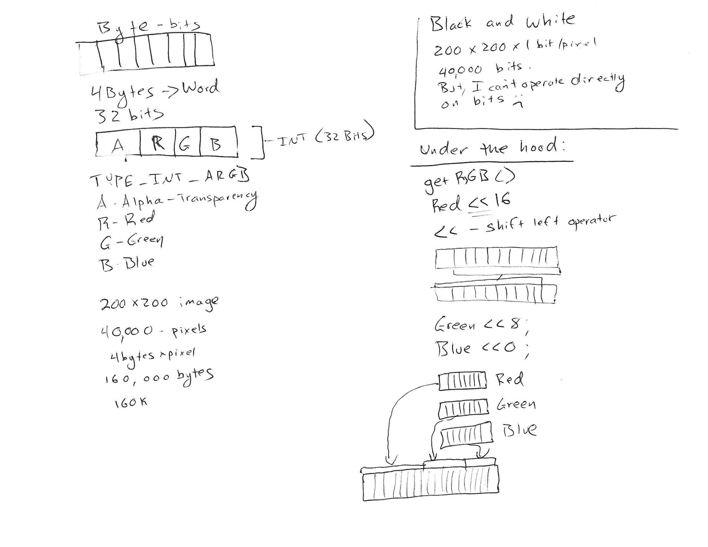

# Day 1 - Introduction

## Day 1 Outline

* Course Intro
* Graphics Intro
* Start Coding

## Day 1 Resources

### Opening Slides

[Image processing and graphics slides](//two.ricks.io)

### Discussion of image processing from "Endgame"

 

(Thor images originally posted on [AnimationBoss.net](http://www.animationboss.net/avengers-endgame-vfx/) are and copyright Marvel.)

### Notes from Class
 

 ### Reading and Writing Images

 [Day 1 Java Code](https://github.com/CS2620/Course/blob/master/Day1.java)