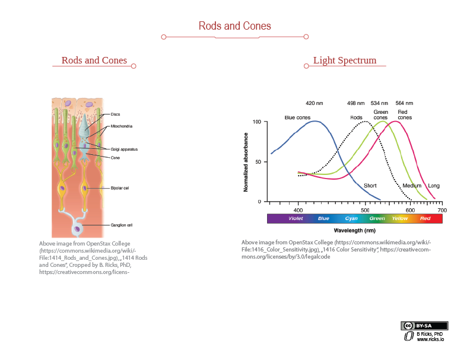

# Day 2 - Rods, Cones, and Pixel Soup

## Day 2 Outline

* Review Day 1 Resources

* Syllabus

* A Sprint-based Class

* Rods and Cones

* Pixel Soup

## Day 2 Resources

[Canvas](https://unomaha.instructure.com/courses/25280)

[Course Github Website](https://github.com/cs2620/)

[Lecture Notes from Day 2](https://github.com/CS2620/Course/blob/master/Day2/LectureNotes.pdf)

[Day 2 Code](https://github.com/CS2620/Course/blob/master/Day2.java)