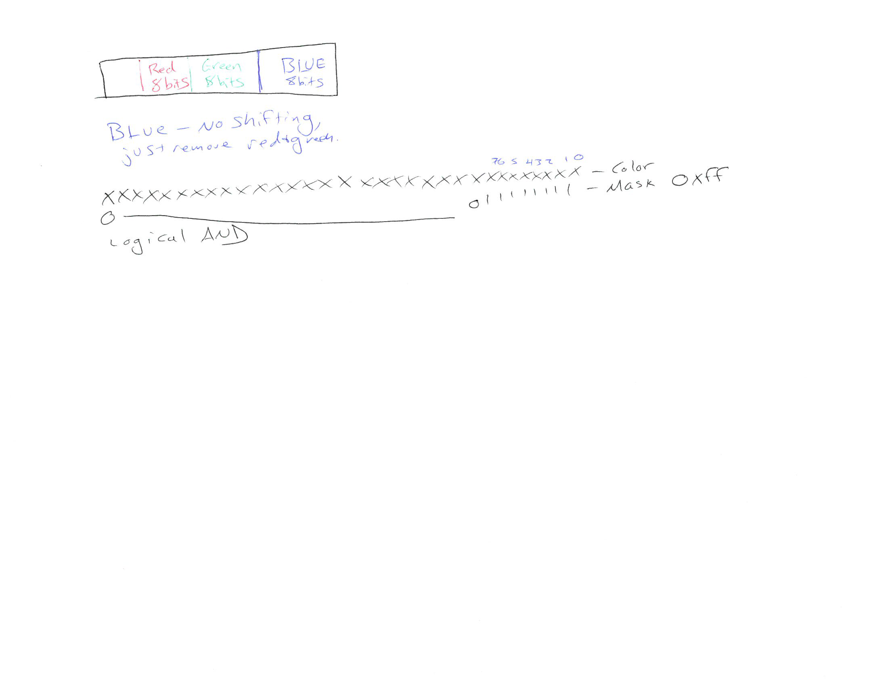

# Day 3 - Color Spaces

## Outline

* Setup Trello 
* Pre first sprint
* Color spaces

## Resources

[Day 3 Presentation](https://two.ricks.io/Day3/)

[Day 3 Code](https://github.com/CS2620/hsv)

### Extracting Colors using Shifting and Masking

