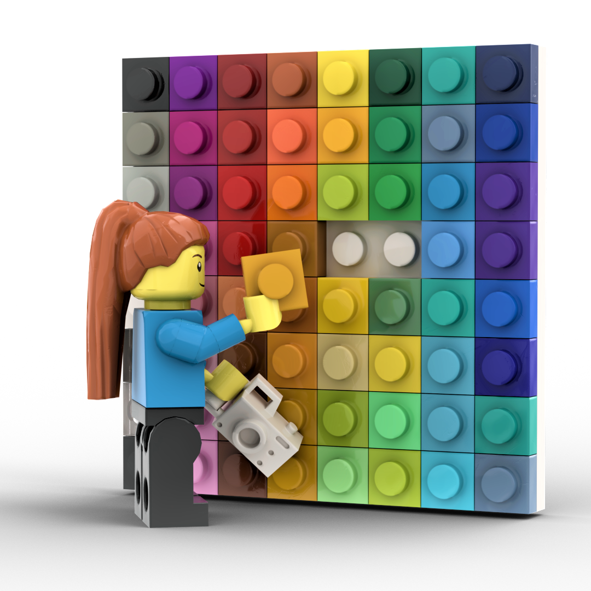

# 2D Graphics

This is the homepage for  CSCI 2620, 2D Graphics: Image Processing, a computer science course at the University of Nebraska at Omaha.

## Class Resources
* [Canvas](https://unomaha.instructure.com/) For the calendar, assignments, attendance, and grades
* [Github](https://github.com/cs2620) For code and the syllabus
* [This website](https://2d.ricks.io) For lecture notes
